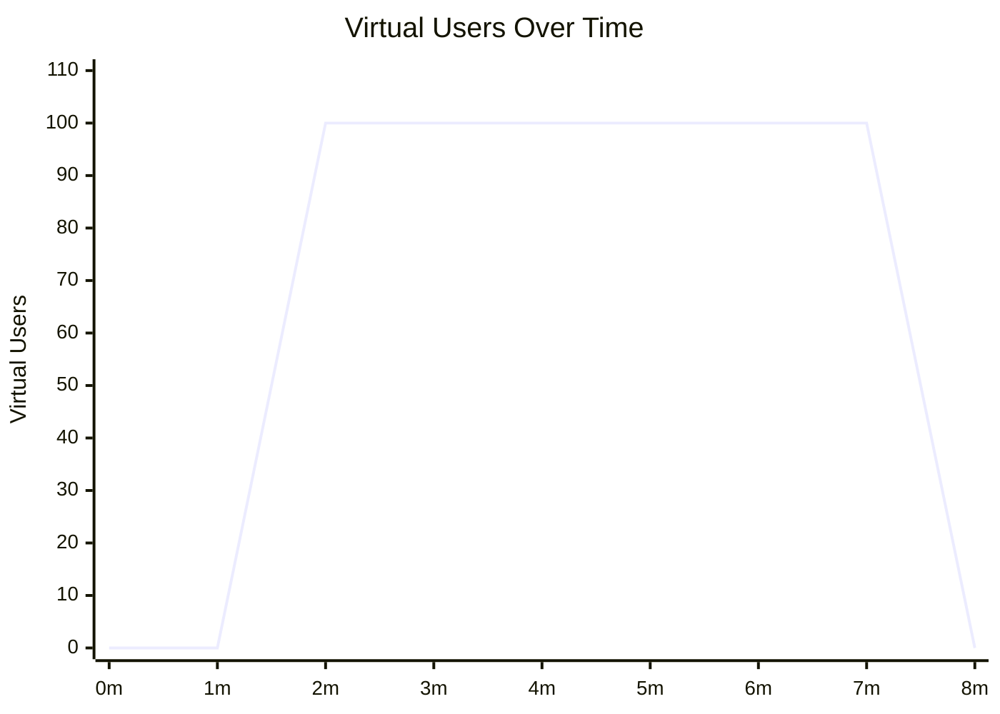

# Load Curves

Load curves let you control how many virtual users (VUs) are active at each point in time, rather than running a fixed number of requests at a fixed concurrency. This models realistic traffic patterns — gradual ramp-up, sustained peak, and cool-down — instead of hitting a service with full load instantly.

## Fixed mode vs. curve mode

| | Fixed mode | Curve mode |
|---|---|---|
| **Config** | `request_count` + `concurrency` | `stages` list |
| **Duration** | Ends when request count is reached | Ends when all stages complete |
| **VUs** | Constant throughout | Varies per stage |
| **Best for** | Quick checks, CI smoke tests | Realistic load simulation, regression gates |

Use **fixed mode** when you need a fast, reproducible result and predictable runtime. Use **curve mode** when you want to observe how your service behaves as load increases, find the point at which latency degrades, or model a real traffic pattern.

## How stages work

A stage has three fields:

| Field | Required | Description |
|---|---|---|
| `duration` | Yes | How long the stage runs. Accepts `30s`, `2m`, `1h`. |
| `target_vus` | Yes | The VU count to reach by the end of this stage. |
| `ramp` | No | How to transition to `target_vus`. Omit for an instant jump. |

Stages run sequentially. VUs at the end of one stage are the starting point of the next.

## Ramp profiles

| `ramp` value | Behaviour |
|---|---|
| *(omitted)* | Jump immediately to `target_vus` at stage start |
| `linear` | Increase VUs evenly across the stage duration |

## Designing a ramp-up/sustain/ramp-down curve

The most common pattern:

```yaml
execution:
  stages:
    - duration: 1m
      target_vus: 0        # idle — give the service time to warm up
    - duration: 1m
      target_vus: 100
      ramp: linear         # gradually bring VUs to peak
    - duration: 5m
      target_vus: 100      # sustain peak — observe steady-state behaviour
    - duration: 1m
      target_vus: 0
      ramp: linear         # ramp down — avoid a cliff edge on the service
```

## VU profile



## Thresholds with curves

Thresholds are evaluated against the **aggregate** results across all stages, not per-stage. If you want to gate on overall p95 latency across the whole run:

```yaml
thresholds:
  - metric: latency_p95
    operator: lt
    value: 500.0
  - metric: error_rate
    operator: lt
    value: 0.01
```

Per-stage metrics are available in the JSON output under `curve_stages`. See [JSON Output Schema](../reference/json-output.md).

## When to use each pattern

| Goal | Recommended pattern |
|---|---|
| CI smoke test after deploy | Fixed — fast and deterministic |
| Find the latency cliff | Curve — ramp until p99 exceeds your SLO |
| Reproduce a real traffic pattern | Curve — model your observed ramp shape |
| Pre-release regression gate | Curve — sustained load over 5–10 minutes |
| Local dev sanity check | Fixed — 100 requests, done in seconds |

## Curves with scenarios

Curve mode works with [scenarios](scenarios.md). VUs are distributed across scenarios by weight, and the curve controls how many VUs are active at each point in time. Each VU runs its assigned scenario's step sequence in a loop until the stage ends.

```yaml
scenarios:
  - name: checkout
    weight: 3
    steps:
      - name: login
        host: https://api.example.com/auth
        method: post
      - name: pay
        host: https://api.example.com/checkout
        method: post

execution:
  stages:
    - duration: 30s
      target_vus: 10
      ramp: linear
    - duration: 2m
      target_vus: 50
    - duration: 30s
      target_vus: 0
      ramp: linear
```

No `request_count` budget in curve mode — VUs run until their stage ends.

## Copy-paste examples

See the [Traffic ramp-up recipe](../recipes/load-curve.md) for ready-to-use YAML configurations.
