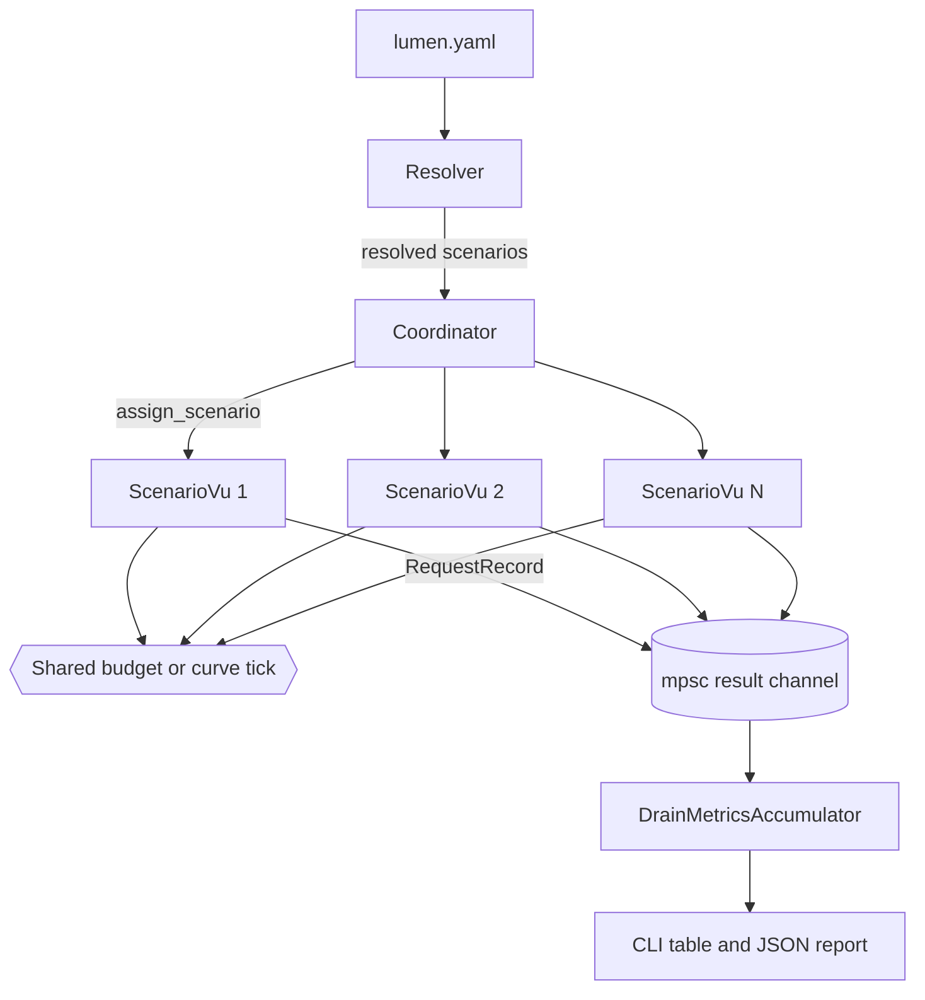
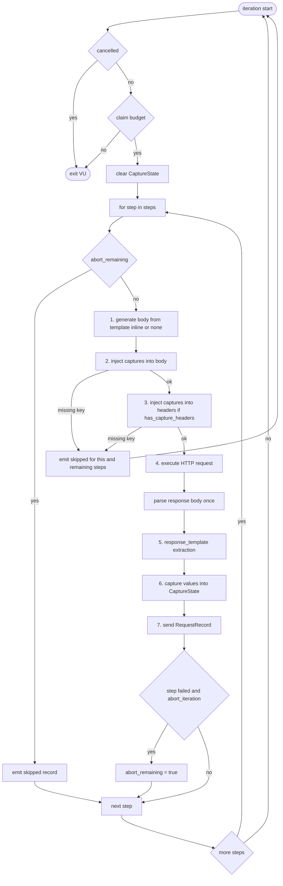
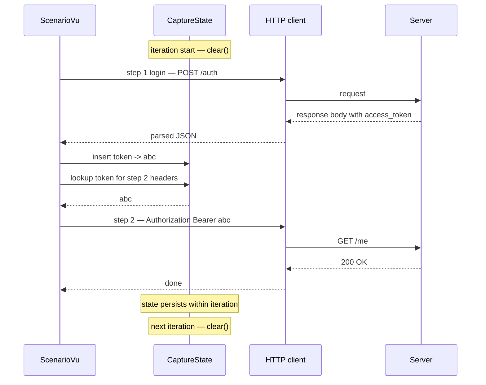
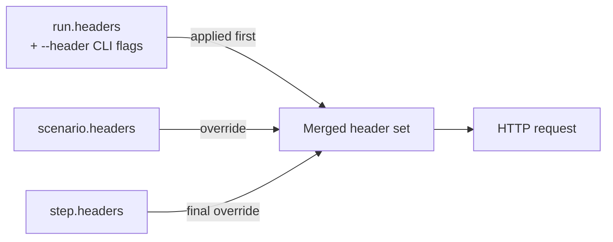
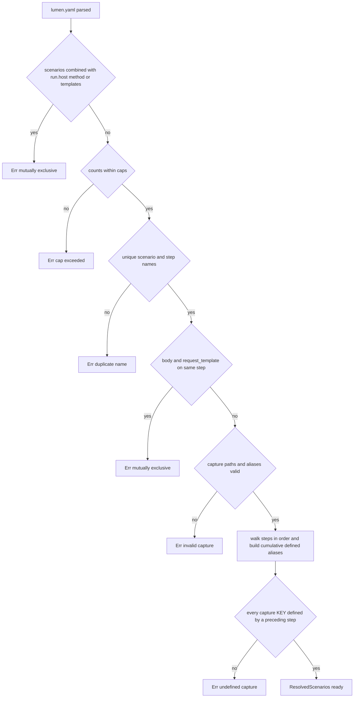

# Scenarios Internals

This page explains what Lumen does under the hood when you run a config with `scenarios`. Read the [Scenarios guide](scenarios.md) first for the user-facing behaviour — this page is the engine-level view.

## Execution model at a glance

A scenarios run turns into three long-lived pieces inside Lumen:

1. **Resolver** — turns the parsed YAML into `Vec<ResolvedScenario>` and fails the run at startup if anything is wrong (undefined captures, conflicting fields, exceeded caps).
2. **Coordinator** — spawns one `ScenarioVu` per virtual user, hands each VU its assigned scenario, and either shares a request budget (fixed mode) or follows the load curve (curve mode).
3. **VU loop** — each `ScenarioVu` claims a budget unit per iteration, clears its capture state, and walks the steps sequentially.





## VU to scenario assignment

`assign_scenario(vu_index, &scenarios)` is a deterministic weighted round-robin:

```rust
let total_weight: u64 = scenarios.iter()
    .fold(0u64, |acc, s| acc.saturating_add(s.weight as u64));
let slot = (vu_index as u64) % total_weight;
let mut cumulative: u64 = 0;
for (i, s) in scenarios.iter().enumerate() {
    cumulative = cumulative.saturating_add(s.weight as u64);
    if slot < cumulative { return i; }
}
```

Properties:

- **Deterministic** — VU 0 always lands in the same scenario across runs, simplifying repro.
- **Proportional** — with weights `[3, 1]` and 8 VUs, scenarios get `{0,0,0,1,0,0,0,1}` (6 and 2).
- **Overflow-safe** — weights are summed in `u64` with `saturating_add`. The config validator caps scenarios at 64 and weight at 10,000, so the sum fits comfortably in `u64` even after saturation.
- **Zero-weight fallback** — if every scenario had weight 0 (validator rejects this, but the runtime guards it anyway), VUs fall back to plain round-robin (`vu_index % scenarios.len()`).

## The VU iteration loop

A `ScenarioVu` owns its steps, a result-channel sender, an optional shared budget, and a cancellation token. Each iteration follows the same seven-phase pattern.



Important details that the diagram abstracts away:

- **The budget is claimed once per iteration, not per step.** A 3-step scenario with `request_count: 100` runs 100 iterations and sends up to 300 HTTP requests.
- **Cancellation is polled before every step** so a `Ctrl-C` or curve-driven VU retirement lands within one request.
- **The response body is parsed once** (`serde_json::from_str`) and the resulting `Value` is reused for both response-template extraction and capture resolution.

## Capture state lifecycle

`CaptureState` is a `HashMap<String, String>` — per-iteration, per-VU. It has no `Arc`, no `Mutex`, no cross-VU visibility. The diagram shows what happens inside one iteration.



Stringification rules (at capture time):

| JSON value | Stored as |
|---|---|
| `String(s)` | `s` (no quotes) |
| `Number(n)` | `n.to_string()` |
| `Bool(b)` | `"true"` / `"false"` |
| `Null` | not inserted (capture miss) |
| `Object` / `Array` | compact JSON (`serde_json::to_string`) |

If injection references an alias that is absent from `CaptureState` — the prior step failed, the JSON path didn't match, or the server returned `null` — the iteration aborts immediately. Sending a request with `{{capture.token}}` left unresolved would pollute metrics with garbage.

## Header merging

Headers cascade through three layers, merged case-insensitively, last-wins:



Case-insensitivity applies to the **name**, not the value. `Authorization` and `authorization` collide; the later one wins. If a step has `{{capture.KEY}}` in any header value, a per-iteration clone of the header list is made before injection so the shared `Arc<Vec<...>>` is not mutated.

## Skipped-step accounting

A request is **skipped** (not failed) when:

- The iteration aborted earlier due to missing captures or `abort_iteration`, and later steps never fired.
- Template injection produced an unresolved `{{capture.KEY}}` reference.

Skipped records have:

```
success:     false
status_code: None
duration:    Duration::ZERO
skipped:     true
```

They contribute to `total_requests` (so request counts stay consistent with iterations × steps) but **do not** feed the latency histogram or status-code counters. CLI output surfaces them as a dedicated `N skip` column; JSON reports include a `requests.skipped` field per scenario and per step.

## Startup validation pipeline

Before any HTTP request is sent, the resolver runs several static checks:



Caps checked in the **counts within caps** box: `scenarios ≤ 64`, `weight ∈ [1, 10_000]`, `headers ≤ 64` per map, `header value ≤ 8192 chars`, `body ≤ 1 MiB`. Paths checked in the **capture paths valid** box: path starts with `$.`, alias matches `[a-zA-Z0-9_]+`.

The **cumulative reference check** is the important one for catching real bugs. The resolver walks steps left to right, accumulating the set of aliases defined so far, and every `{{capture.KEY}}` reference (in a header value, inline body, or request-template body) must resolve against that set. Typos and reordering mistakes fail the run before a single request goes out.

Runtime extraction failures (server returns unexpected JSON, a path no longer matches) are a different beast — they surface as skipped records and iteration aborts, not config errors.

## Where to look in the code

| Piece | File |
|---|---|
| `ResolvedScenario`, `assign_scenario`, `ResolvedStep` | `lmn-core/src/execution/mod.rs` |
| VU iteration loop | `lmn-core/src/vu/scenario.rs` |
| Capture state, injection, JSON path | `lmn-core/src/capture/mod.rs` |
| Config parsing and caps | `lmn-core/src/config/lumen_config.rs` |
| Resolver + static validation | `lmn-core/src/config/resolver.rs` |
| Budget claiming | `ScenarioVu::claim_budget` in `vu/scenario.rs` |
| Metrics drain | `DrainMetricsAccumulator` in `execution/` |

## Design notes

- **No `Arc<Mutex<...>>` on the hot path.** Captures are owned by the VU; headers are `Arc<Vec<...>>` shared across iterations unless capture injection forces a clone. The `has_capture_headers` flag is computed at resolve time and guards the clone.
- **Accumulator keys are `Arc<str>`** (`scenario_name`, `step_name`), so per-request aggregation avoids allocating a fresh `String` for every record.
- **Sort once.** Scenarios and steps are sorted in `into_stats()` at drain time, not in the hot path.
- **Failure blast radius is one iteration.** Skipped steps, missing captures, and `abort_iteration` all stay scoped to the current iteration — the next iteration starts clean.
