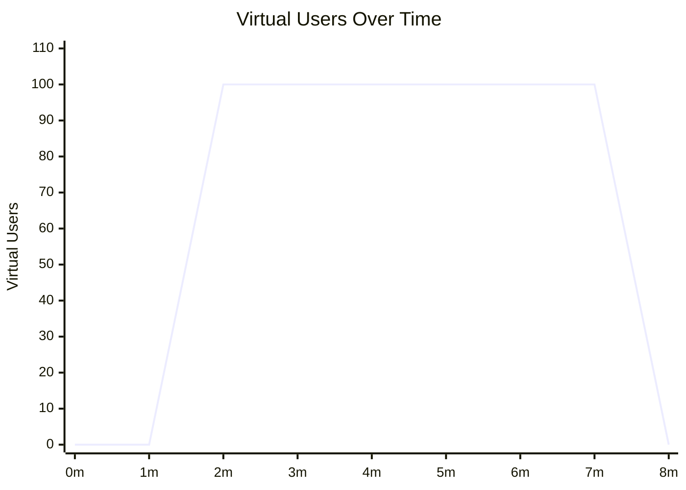

# Traffic ramp-up

## Ramp-up → sustain → ramp-down

```yaml
# lmn.yaml
run:
  host: https://api.example.com/orders
  method: get

execution:
  stages:
    - duration: 1m
      target_vus: 0
    - duration: 1m
      target_vus: 100
      ramp: linear
    - duration: 5m
      target_vus: 100
    - duration: 1m
      target_vus: 0
      ramp: linear

thresholds:
  - metric: latency_p95
    operator: lt
    value: 500.0
  - metric: error_rate
    operator: lt
    value: 0.01
```

```bash
lmn run -f lmn.yaml
```

## VU profile



## Simple ramp-up

```yaml
execution:
  stages:
    - duration: 30s
      target_vus: 5
    - duration: 2m
      target_vus: 50
      ramp: linear
    - duration: 30s
      target_vus: 0
      ramp: linear
```

See [Load Curves](../guides/load-curves.md) for how stages work, ramp profiles, and when to use curves vs. fixed mode.
